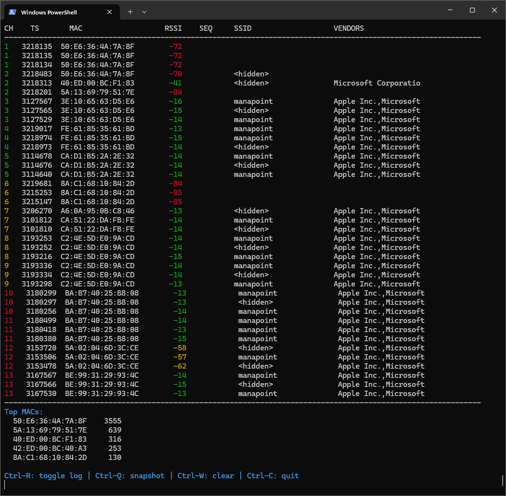

<h1 align="center">🛰️ WiFi Probe Sniffer</h1>
<h3 align="center">ESP32/ESP8266 firmware + Python live viewer</h3>

<p align="center">
  <b>Sniff Wi-Fi probe requests, beacons, and management frames across all 2.4 GHz channels — using an ESP32 and a colorful Python terminal viewer.</b>
</p>

---

## ✨ Overview

This project turns your **ESP32** (or ESP8266) into a compact **Wi-Fi frame sniffer**.  
It captures probe requests, management frames, and data packets headers, and streams them in **JSON** format to your computer.

On the host side, a **Python viewer** displays detections in real-time:
- Colored RSSI levels (green → strong, red → weak)  
- Per-channel summaries  
- Live logging and snapshot shortcuts  
- Vendor detection from MAC OUI prefixes  

---

---
## ⚙️ Features

| Capability | Description |
|-------------|-------------|
| 📡 **Frame capture** | Probe, beacon, management & data frames |
| 🔀 **Channel hopping** | Scans all 1–13 channels automatically |
| 💾 **JSON serial output** | Human- and machine-readable |
| 🧠 **Vendor lookup** | Detects device manufacturer (Apple, Samsung, Xiaomi, etc.) |
| 🎨 **Color display** | RSSI-based color coding |
| ⌨️ **Interactive controls** | Start/stop log, snapshot, clear buffer |

---

## 🧩 Requirements

- **ESP32** (recommended) or ESP8266 board  
- **Python 3.8+**
- Required packages:

  ```bash
  pip install pyserial colorama
  ```

---

## 🚀 Quick Start

### 1️⃣ Flash the ESP32 firmware

1. Open **`firmware/Interceptor_ESP32_V1.ino`** in Arduino IDE  
2. Select your ESP32 board and serial port (`COM4`, `/dev/ttyUSB0`, …)  
3. Upload — the ESP32 begins sending JSON frames at **921 600 baud**

---

### 2️⃣ Run the Python viewer

**Live mode**
```bash
python serial_probe_viewer.py COM4 921600
```

**Playback mode**
```bash
python serial_probe_viewer.py captures.jsonl
```

**Filter by channel**
```bash
python serial_probe_viewer.py COM4 921600 --channel 6
```

**Show last N detections per channel**
```bash
python serial_probe_viewer.py COM4 921600 --nlast 15
```

---

## 🧱 Repository Structure

```
WiFiProbeSniffer/
├── firmware/
│   └── Interceptor_ESP32_V1.ino       # ESP32 firmware
├── host/
│   ├── serial_probe_viewer.py         # live viewer
│   ├── acquireWiFiDetections.py       # JSON capture utility
│   ├── displayWiFiCaptures.py         # playback viewer
│   └── setup.sh / setup.bat           # install helpers
└── README.md
```

---

## 🧠 Troubleshooting

**Only a few channels detected**  
→ Ensure hopping is enabled (`HOP ON` or `SET CH ALL`)

**No detections**  
→ Check serial port and baud rate (921 600 baud) and that `LOG ON` is active

**Weird colors under Windows**  
→ Use **PowerShell** or **Windows Terminal**

**Process JSON output with jq**
```bash
python acquireWiFiDetections.py -s | jq .
```

---

## 📜 License

Released under the **MIT License**  
© 2025 — Université de la Polynésie française (UPF) · Jean Martial Mari
